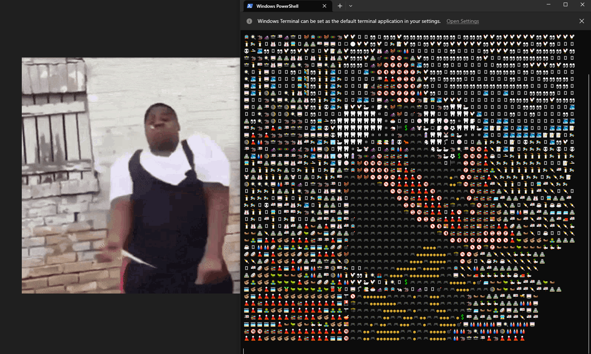

# Emoji Madness

Emoji Madness is a Python program that takes GIF images and converts them into text art using emojis. It utilizes the Python Imaging Library (PIL) to process images, calculate average colors, and map them to emojis from a predefined list. The resulting text art is displayed in the terminal.

## Features

- Convert GIF images into text art made up of emojis.
- Calculate the average color of emojis.
- Map RGB colors to emojis.
- Display the text art in the terminal.
- Supports Windows and Unix-based systems.

## Prerequisites

Before running Emoji Madness, make sure you have the following prerequisites installed:

- Python (3.x recommended)
- Python Pillow library (`PIL`)
- Python `json` library
- Python `math` library
- Python `os` library
- Python `time` library

## Usage

1. Clone the Emoji Madness repository from GitHub:

    git clone https://github.com/ShmukaDuk/emoji_madness.git
    Navigate to the project directory:
    cd emoji_madness
    Place your GIF images in the project directory or provide the path to your GIF image in the prepImage function.

2. Setup Emoji Db:

    Create a file named emojisbase and add your emojis to it, one per line:
    🌊
    😀
    🌸
    you may need to run generate convertEmojiToRGB() and save to json. I have pre compiled some emojis here allready.

3. python gogo.py

## Contributing
If you'd like to contribute to Emoji Madness, feel free to fork the repository and submit a pull request with your changes.

License
This project is licensed under the MIT License. See the LICENSE file for details.